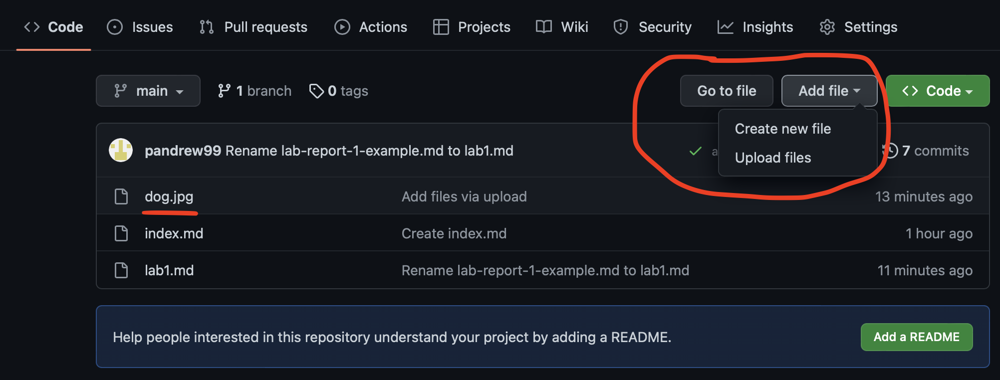

# Lab Report 1 - Remote Access and FileSystem

You’ll submit a lab report by writing a blog post about remote access, like we just described using Github Pages. The lab report is due Monday, April 10 by 10pm. See the FAQ below for common questions, including how to add images and what to submit to Gradescope.

You will write a tutorial for incoming 15L students (and your future self!) about how to log into a course-specific account on `ieng6`. Your post should include all the steps you took, along with screenshots of what each step looked like. You’re free to use the screenshots you took for lab 1, or new ones. Complete any steps you didn’t complete in your group on your own.

Overall, make sure you have at least 3 screenshots, one for each of the steps below (though more is useful, remember that this will help out your future self). For each step include at least 2-3 sentences or bullet points describing what you did. If for some reason you didn’t do the step exactly, describe why not (maybe your computer already had something on it, maybe the department computers worked differently, etc).

- Installing VScode
- Remotely Connecting
- Trying Some Commands

You should complete the writing **on your own**. Feel free to ask anyone (staff or other students are fine!) for help if you’re struggling to get remote access set up, understand commands, get your writing to show up on Github Pages, etc. But do not get help from anyone on authoring the report itself – the writing and screenshots **must** be your own.

If you get totally stuck or unable to log in (try a few times and ask for help if stuck!), describe how you got stuck as much as you’re able. We’ll give some feedback and you’ll be able to come to office hours for help to resubmit once you get everything working, but do show us what you tried!

You will upload your submission by publishing the page on Github Pages, then printing the page to PDF and uploading to the Lab Report 1 assignment on Gradescope.

## Submission FAQ

**Should I submit the Google Doc we used during the lab session for this Lab Report Assignment?**

No, this individual lab report submission is about the screenshot tutorial you’ll put on your own Github Pages.

You need not upload the shared notes Google doc anywhere.

**How do I add images/screenshots to my lab report?**

In your repository, click the “add file” button and then click “upload files”. Upload the screenshots you want to include from your computer. Then, in the .md file you created for your lab report 1, you can add the images by using the `` syntax as described in the markdown cheat sheet link from earlier. Replace `imageName.png` with whatever your image is named in your repository. For example, in the screenshot below, I have `dog.jpg` in my repository so I could include that screenshot by typing `` in my lab1.md file. 

**How do I submit my Github Pages site to Gradescope?**

Visit your Github Pages website with your tutorial in a browser (Safari, Chrome, Brave, Firefox, Edge, etc), and use “Print” to save it to a PDF. Then, upload the PDF to the “Lab Report 1 - Remote Access and Filesystem” assignment on Gradescope. For example, if your Github Pages site has the link [https://pandrew99.github.io/cse15l-lab-reports-example](https://pandrew99.github.io/cse15l-lab-reports-example) and you made your lab report 1 .md file called `lab1.md`, you would access it by adding `lab1.html` at the end, like: [https://pandrew99.github.io/cse15l-lab-reports-example/lab1.html](https://pandrew99.github.io/cse15l-lab-reports-example/lab1.html).

**How should I match pages with questions when submitting to Gradescope?**

You should match all pages of your lab report to the question called “Score”. This makes it easier for us to grade your lab reports and provide feedback faster.

**Can I use screenshots from the lab document we worked on together?**

Sure! If they are from your account, that’s fine. If you were unable to get your `ssh` login to complete all these steps, don’t share another user’s screenshots, instead describe where you got stuck and include a screenshot of what doesn’t work.
